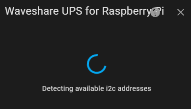
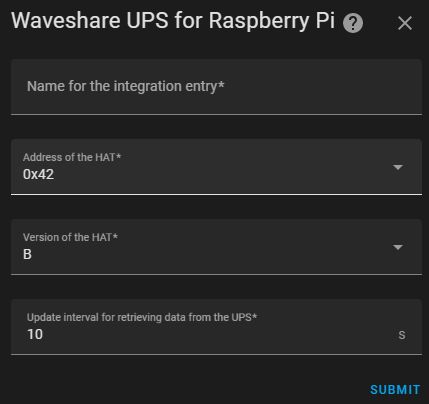
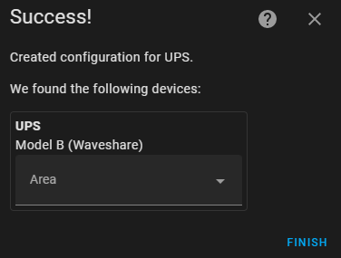
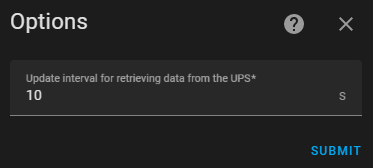

# Waveshare UPS for Raspberry Pi

Home Assistant integration for the Waveshare UPS for Raspberry Pi.

## Description

This integration can be used to get information over i2c for the
Waveshare UPS for the Raspberry Pi.
The integration assumes that you have followed the instructions for
enabling i2c on your Raspberry Pi. These instructions will differ
depending on how you are running Home Assistant.

If you are running Home Assistant OS see
[here](https://www.home-assistant.io/common-tasks/os/#enable-i2c).

If you are running Raspberry Pi OS see
[here](https://www.raspberrypi.com/documentation/computers/configuration.html).

### Entities Provided

#### Binary Sensors

* __Battery State__ - whether the battery is charging or not.

#### Sensors

* __Battery Level__ - percentage of power left in the battery
* __Current__
* __Load Voltage__ - the voltage on V- (load side)
* __Power__
* __PSU Voltage__ - Load Voltage + Shunt Voltage
* __Shunt Voltage__ - voltage between V+ and V- across the shunt

## Setup

### `Add Integration` button

Clicking the `Add Integration` button will cause the integration to start
looking for available devices on i2c.

Once the detection process has finished the following information will be
required.

* __Name__ - friendly name for the configuration entry
* __Address of the HAT__ - if only a single address was found it will be
selected. If multiple addresses are found the first is selected and you'll
need to pick the correct one to use.
* __Version of the HAT__ - defaults to B. You should pick the version that you
have.
* __Update interval__ - defaults to 10s. Defines how often to query the UPS.

On successful set up the following screen will be seen detailing the device.

## Configurable Options

It is possible to configure the following options for the integration.

* __Update interval__ - defaults to 10s. Defines how often to query the UPS.
* __Mimimum current value for charging__ - defaults to -100mA. In my usage I've
found that whilst the documentation for the HAT states a negative current
means that the Pi is being powered by the batteries it can drop below 0 on
normal use. This value allows you to mitigate this.
